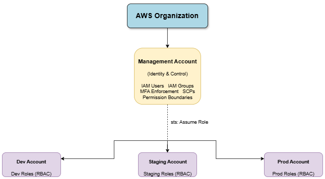

# Enterprise-Grade-IAM-Architecture-Multi-Account-Setup
# Overview

This project defines the **Enterprise-Grade Identity and Access Management (IAM) Architecture** for a secure, scalable, and compliant multi-account cloud environment built on **Amazon Web Services** using **AWS Organizations**.

The architecture is designed for a company operating multiple environments (**Dev, Staging, and Production**) with multiple functional teams (**Developers, DevOps, Security, and Finance**). It enforces **least privilege access**, **zero-trust security principles**, and **defense-in-depth controls**.

Access is fully **role-based**, with **no direct user permissions**. All users authenticate centrally and gain access only through **secure cross-account role assumption**, protected by **MFA**, **permission boundaries**, and **organization-wide policies (SCPs)**.

This model provides enterprise-level governance, auditability, and scalability while minimizing security risk and operational complexity.

## Architecture
The following diagram illustrates the enterprise IAM multi-account design.




## Objectives

The primary objectives of this IAM architecture are:

1. **Security**
    - Enforce **least privilege** at every access layer
    - Prevent **privilege escalation**
    - Eliminate **standing administrative access**
    - Enforce **mandatory MFA** for all access
2. **Governance**
    - Centralized identity management
    - Organization-wide security guardrails
    - Standardized access patterns
    - Policy-based enforcement model
3.  **Scalability**
    - Support for multiple accounts and environments
    - Easy onboarding of new teams and services
    - Structured growth without security debt
4. **Compliance & Auditability**
    - Full audit trails
    - Clear access boundaries
    - Separation of duties
    - Regulatory readiness (SOC2, ISO 27001, PCI-DSS models)

---

## Tools & Control Mechanisms

This architecture uses the following core security and governance components:

1.  **Identity & Access**
    - IAM Users (identity only, no permissions)
    - IAM Groups (team-based routing)
    - IAM Roles (permission containers)
    - Cross-account role assumption
    - Role-based access control (RBAC)
      
2.  **Organization Governance**
    - AWS Organizations
    - Organizational Units (OUs)
    - Centralized account management
    - Multi-account isolation
3.  **Security Controls**
    - **Permission Boundaries** – limit maximum privileges
    - **Service Control Policies (SCPs)** – org-wide restrictions
    - **Multi-Factor Authentication (MFA)** – identity verification
    - **Trust Policies** – control who can assume roles
    - **Audit Logging** – centralized access tracking
4.  **Defense-in-Depth Layers**
    - Identity layer
    - Role layer
    - Boundary layer
    - SCP layer
    - MFA layer
    
      ---

## Architecture Overview

### Multi-Account Structure

```
Organization Root
│
├── Management Account (Identity, IAM, SCPs, Security Control Plane)
│
├── Dev Account (Development workloads)
├── Staging Account (Testing & QA workloads)
└── Prod Account (Production workloads)
```

---

### Team-Based Access Model

Each team has a dedicated IAM group in the **Management Account**:

- Developers
- DevOps
- Security
- Finance

Groups contain **only role-assumption permissions**, not service permissions.

---

### Role-Based Access Model

Each account contains environment-specific roles:

- Dev roles
- Staging roles
- Production roles

Users access resources only through:

```
User → IAM Group → AssumeRole → Cross-Account Role → Permissions
```

---

### Cross-Account Trust Model

- Roles trust only the Management Account
- Access requires role assumption
- Trust policies enforce MFA
- No direct access to environment accounts

---

### Core Security Principles Applied

- Zero trust access model
- No direct user permissions
- No standing privileges
- Environment isolation
- Centralized identity
- Decentralized access
- Defense-in-depth
- Least privilege by default

---

This structure is suitable for:

- Enterprise environments
- Regulated industries
- Financial systems
- SaaS platforms
- Government-grade architectures
- Security-first organizations

---

# Implementation process

---
 ### Phase 1 - Establish Multi-Account Structure
Create isolated environments for security, governance, and blast-radius containment.

### Phase 2 - Centralize Identity Management
Manage all IAM users in the Management Account only with the **Dangerous Actions Policy**
